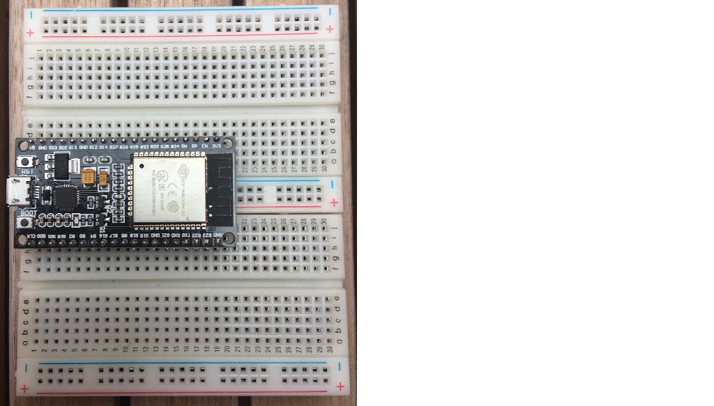
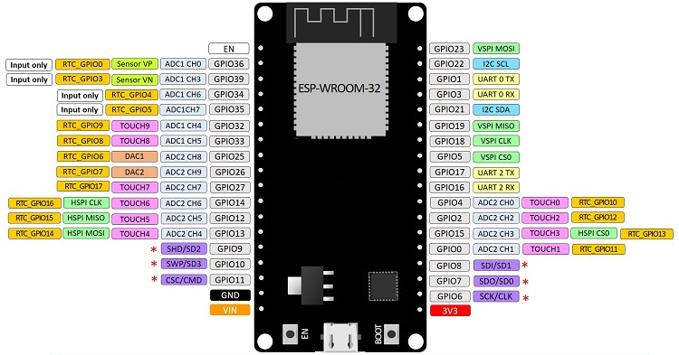
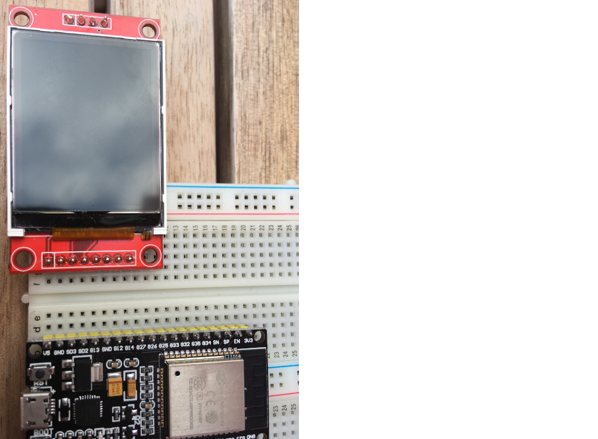
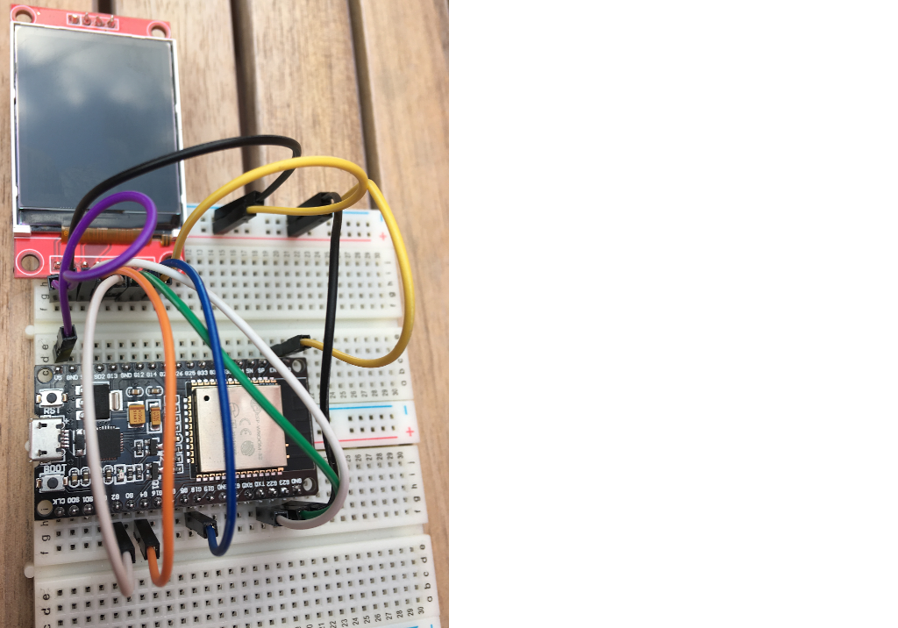
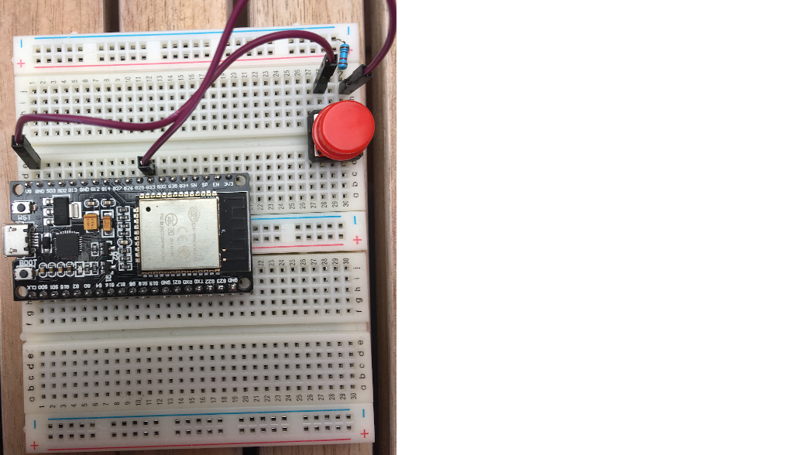
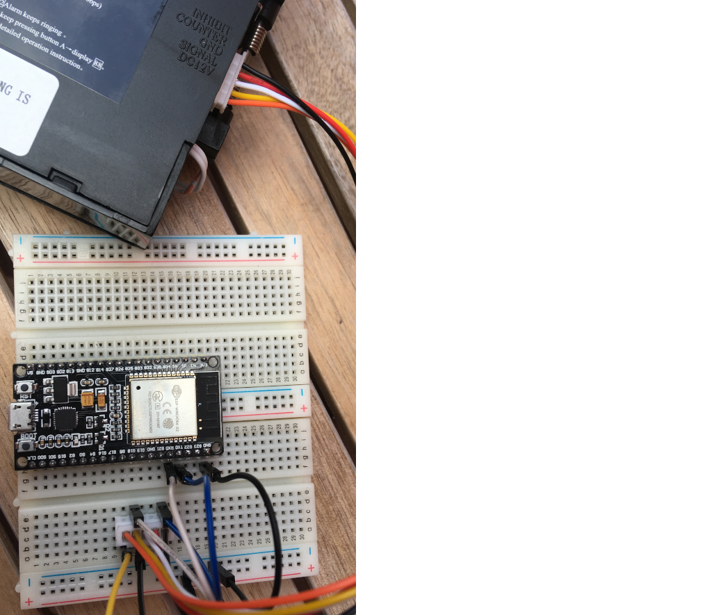
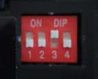

# Bleskomat DIY

This is the do-it-yourself (DIY) version of the Bleskomat ATM. If you're looking for the Bleskomat ATM product, you can find more information at [www.bleskomat.com](https://www.bleskomat.com).

Key features of the Bleskomat ATM include:
* Works offline - no WiFi required
* Inexpensive, easily-sourced components
* Easily hackable and extendible
* Plug it in and it's ready to accept fiat in seconds

The Bleskomat ATM must be paired with a [bleskomat-server](https://github.com/samotari/bleskomat-server) which can facilitate Lightning Network payments on behalf of one or more ATMs.

The rest of this document details how you can build your own version of the Bleskomat ATM project:
* [Requirements](#requirements)
	* [Hardware Requirements](#hardware-requirements)
		* [Parts Suppliers](#parts-suppliers)
	* [Software Requirements](#software-requirements)
* [Building the Hardware Device](#building-the-hardware-device)
	* [Prepare the breadboards](#prepare-the-breadboards)
		* [ESP32 devkit pinout](#esp32-devkit-pinout)
	* [Wiring the Power Supply](#wiring-the-power-supply)
		* [Optionally power the ESP32 devkit via 5V pin](#optionally-power-the-esp32-devkit-via-5v-pin)
	* [Wiring the TFT Display](#wiring-the-tft-display)
		* [Wiring the SD card slot](#wiring-the-sd-card-slot)
	* [Wiring the button](#wiring-the-button)
	* [Wiring the Coin Acceptor](#wiring-the-coin-acceptor)
* [Configure and Train Coin Acceptor](#configure-and-train-coin-acceptor)
* [Installing Libraries and Dependencies](#installing-libraries-and-dependencies)
* [Compiling and Uploading to Device](#compiling-and-uploading-to-device)
* [Configuring The Bleskomat](#configuring-the-bleskomat)
	* [Hard-coded configuration](#hard-coded-configuration)
	* [Configuration via SD card](#configuration-via-sd-card)
* [License](#license)
* [Trademark](#trademark)


## Requirements

This section includes information about the software and hardware requirements needed to build this project.


### Hardware Requirements

Basic components/equipment needed to build your own Bleskomat (DIY) ATM:
* 2 x breadboard (400-pin)
* Connecting cables (M-M)
* Connecting cables (M-F)
* ESP32 Devkit
* DG600F Coin Acceptor
* 1.8" TFT display
* Button
* 10k ohm resistor
* DC 5.5/2.1 mm DIP adapter
* 12V DC power adaptor with \~1A
* Standard USB to micro USB cable
* Multimeter

Optional components/equipment:
* Soldering iron
* 2.54 mm pins
* To power the ESP32 devkit from the 12V DC power supply:
	* XL4005 step-down converter
	* USB (F) adapter
	* Alternatively, you could use a USB car charger which includes both a step-down converter and USB (F) output
* If you wish to configure your Bleskomat via SD card:
	* Micro SD card with macro adapter


#### Parts Suppliers

Below are parts lists based on geographic location:

* [czech-republic](docs/parts-lists/czech-republic.md)

If you'd like you add your own list, please create a pull-request using [this template](docs/parts-lists/TEMPLATE.md) as a guide.

### Software Requirements

* [make](https://www.gnu.org/software/make/)
* [PlatformIO Core (CLI)](https://docs.platformio.org/en/latest/core/)
	* Version 5 or newer
	* Only the CLI ("Core") is required


## Building the Hardware Device

Before proceeding, be sure that you have all the project's [hardware requirements](#hardware-requirements).

Step-by-step build process for the hardware device.

### Prepare the breadboards

One breadboard is not large enough to accommodate all the pins of the ESP32 devkit due to the width of the devkit. This is why we recommend to connect two breadboards together.

Remove one of the power rails from one of the breadboards. Use the notches on the sides of the breadboards to connect them together length-wise.

Insert the ESP32 devkit into the pin holes of the new, combined breadboard.



Familiarize yourself with the ESP32 devkit's pinout reference below.

#### ESP32 devkit pinout




### Wiring the Power Supply

The first step to building the device is wiring the power supply. If already plugged in, __unplug__ the 12V DC power supply now. Connect the DC 5.5/2.1 end of the power supply to the DIP adapter. The positive (+) pins should be the power pins and the negative (-) pins should be the ground. You can use your multimeter to check in case you want to be extra safe:
* Plug-in the power supply to electricity
* Turn on your multimeter and set it to measure voltage in the appropriate range (probably 20V)
* Touch the __red__ lead of your multimeter to one of the positive pins
* Touch the __black__ lead of your multimeter to one of the negative pins
* If you see a negative voltage reading, swap the leads between the two wires
* The pin touched by the __black__ lead is the ground ("GND")
* The pin touched by the __red__ lead is the hot wire ("DC12V")
* Unplug the power supply again

Use a pair of M-F connecting cables to connect the DC 5.5/2.1 DIP adapter to one of the breadboard's power rails. Negative to negative, positive to positive. This rail will be your 12V DC power (positive) and the common ground (negative).

#### Optionally power the ESP32 devkit via 5V pin

If you'd like to make your Bleskomat build a little bit more portable, you can power the ESP32 devkit via its 5V pin. To do this you will need the XL4005 (or equivalent) step-down converter and the USB (F) adapter. Note that powering the ESP32 devkit via its micro USB port requires a regulated voltage of approximately 5V.

It's also possible to use a USB car charger in case you have an extra one lying around.

Connect the step-down converter's input pins to the 12V DC power rail and common ground using (M-F) connecting cables. Use a multimeter to measure the voltage at the out pins. In the case of the XL4005, use a small screwdriver to turn the screw on the little blue box. Turning the screw counter clockwise should lower the voltage, turning it the opposite direction should increase the voltage. Once you have the voltage set to 5V, connect the out pins to the center power rails of the breadboard. This will be your 5V DC power rail.

Use a soldering iron to solder four 2.54 mm pins to the USB (F) DIP adapter. Insert the pins directly into the breadboard wherever you have space available. Using (M-M) connecting cables, connect the negative and positive pins of the USB (F) DIP adapter to the 5V DC power rail.

Connect the negative pin of the 5V DC power rail to the negative of the 12V DC power rail to ensure that they share a common ground. This is important because without a common ground shared between the coin acceptor and ESP32 devkit, the ESP32 will not receive a clean signal from the coin acceptor.

Use a standard USB to micro USB cable to connect the USB (F) DIP adapter to the ESP32 devkit.

There are other options when powering the ESP32 - e.g via the 3.3V pin or the 5V/VIN pin. You should __never__ power the ESP32 via more than one of these options at the same time. For example, do not power the ESP32 via its 3.3V pin while also connecting the ESP32 via USB to your computer. This can damage the ESP32 and possibly also your computer.


### Wiring the TFT Display

Insert the pins of the TFT display module into the breadboard where you have space available.



Use the table below to connect the ESP32 devkit to the TFT display module.

|  ESP32       | TFT        |
|--------------|------------|
| VIN (V5)     | VCC        |
| GND          | GND        |
| GPIO22       | CS         |
| GPIO4        | RESET      |
| GPIO2        | AO         |
| GPIO23       | SDA        |
| GPIO18       | SCK (CLK)  |
| 3V3          | LED (NC)   |

Notes on pin naming:
* There are boards where `GPIXXX` are marked as `GXX` instead of `DXX`.
* The `G23` may be there **twice** - the correct one is next to `GND`.
* Some boards have typos so a bit of guess-and-check is necessary sometimes.



Refer to the [ESP32 devkit pinout](#esp32-devkit-pinout) for help identifying the pins on your ESP32.


#### Wiring the SD card slot

This step is only needed if you would like to configure your Bleskomat via an SD card.

The TFT display includes an SD card slot. The pins are located above the screen and not soldered to the module by default but the pins can be added. The table of mappings is the following:

| ESP32  | TFT     |
|--------|---------|
| GPIO15 | SD_CS   |
| GPIO13 | SD_MOSI |
| GPIO12 | SD_MISO |
| GPIO14 | SD_SCK  |

Refer to the [ESP32 devkit pinout](#esp32-devkit-pinout) for help identifying the pins on your ESP32.


### Wiring the button

Insert button pins into the breadboard wherever you have space available. Typically, its best to place the button at the center of a breadboard (over the gap).

Connect the button using the following table as a guide:

| ESP32    | Button    |
|----------|-----------|
| VIN (V5) | left pin  |
| GPIO33   | right pin |

Connect the right pin of the button to GND with a 10k ohm resistor.



Refer to the [ESP32 devkit pinout](#esp32-devkit-pinout) for help identifying the pins on your ESP32.


### Wiring the Coin Acceptor

| ESP32       | DG600F   | Power Supply  |
|-------------|----------|---------------|
| GPIO1 (TX0) | INHIBIT  |               |
|             | COUNTER  |               |
|             | GND      | - Ground      |
| GPIO3 (RX0) | SIGNAL   |               |
|             | DC12V    | + 12V DC      |



Refer to the [ESP32 devkit pinout](#esp32-devkit-pinout) for help identifying the pins on your ESP32.


## Configure and Train Coin Acceptor

Physical switches on the DG600F should set as follows:

| Switch           | State         |
|------------------|---------------|
| 1 (Port Level)   | Down (NO)     |
| 2 (Security)     | Down (Normal) |
| 3 (Transmitting) | Up (RS232)    |
| 4 (Inhibiting)   | Down (> +3V)  |



Open the [DG600F manual](docs/DG600F-Coin-Acceptor-Technical-Manual.pdf) to "Coin Acceptor Parameters Setting" on page 18. Set the parameters as follows:

| Parameter | Description                      | Value | Meaning                                          |
|-----------|----------------------------------|-------|--------------------------------------------------|
| A1        | machine charge amount            | 01    | min. coin value before data sent                 |
| A2        | serial output signal pulse-width | 01    | 25ms / 9600 bps (RS232 baud rate)                |
| A3        | faulty alarm option              | 01    | (rings only one time)                            |
| A4        | serial port RS232 signal length  | 03    | 3 bytes: 0xAA, coin value, XOR of prev two bytes |
| A5        | serial port output               | 01    | output to serial pin                             |


To train the coin acceptor, have a look at "Coin Parameters Setting" on page 16 of the [DG600F manual](docs/DG600F-Coin-Acceptor-Technical-Manual.pdf). Be sure to set the "coin value" for each coin in series, incremented by 1. For example:
* 0.05 EUR = 1 coin value
* 0.10 EUR = 2 coin value
* 0.20 EUR = 3 coin value
* 0.50 EUR = 4 coin value
* 1.00 EUR = 5 coin value
* 2.00 EUR = 6 coin value

Then in bleskomat.conf, set the `coinValues` setting as follows:
```
coinValues=0.05,0.10,0.20,0.50,1,2
```


## Installing Libraries and Dependencies

Before proceeding, be sure that you have all the project's [software requirements](#software-requirements).

Use make to install libraries and dependencies needed to build the firmware:
```bash
make install
```
* The firmware's dependencies are defined in its platformio.ini file located at `./platformio.ini`

If while developing you need to install a new library, use the following as a guide:
```bash
platformio lib install LIBRARY_NAME[@VERSION]
```
You can find PlatformIO's libraries repository [here](https://platformio.org/lib).


## Compiling and Uploading to Device

To compile the firmware (without uploading to a device):
```bash
make compile
```

To compile and upload to your device:
```bash
make upload DEVICE=/dev/ttyUSB0
```
The device path for your operating system might be different. If you receive a "Permission denied" error about `/dev/ttyUSB0` then you will need to set permissions for that file on your system:
```bash
sudo chown $USER:$USER /dev/ttyUSB0
```

To open the serial monitor:
```bash
make monitor DEVICE=/dev/ttyUSB0
```
Again the device path here could be different for your operating system.


## Configuring The Bleskomat

The following is a list of possible configuration options for your Bleskomat (DIY) ATM:
* `apiKey.id` - The API key ID of the device. This is needed by the server to verify signatures created by the device.
* `apiKey.key` - The API key secret that is used to generate signatures.
* `apiKey.encoding` - The explicit encoding of the API key secret. This can be "hex", "base64", or empty-string (e.g "") to mean no encoding. When generating a new API key on the server, it will store the encoding along with the ID and secret.
* `callbackUrl` - The LNURL server base URL plus endpoint path. Example:
	* `https://your-bleskomat-server.com/u`
* `shorten` - Whether or not to shorten the LNURL; see the [lnurl-node module](https://github.com/chill117/lnurl-node#signed-lnurls) for more details.
* `uriSchemaPrefix` - The URI schema prefix for LNURLs generated by the device. It has been discovered that some wallet apps mistakenly only support lowercase URI schema prefixes. Uppercase is better because when encoded as a QR code, the generated image is less complex and so easier to scan. Set this config to empty-string (e.g `uriSchemaPrefix=`) to not prepend any URI schema prefix.
* `fiatCurrency` - The fiat currency symbol for which the device is configured; see [ISO 4217](https://en.wikipedia.org/wiki/ISO_4217).
* `fiatPrecision` - The number of digits to the right of the decimal point when rendering fiat currency amounts.
* `coinValues` - The value of coins for which the coin acceptor has been configured. Each value separated by a comma. Integers and floating point (decimal) values are accepted. For example, when trained with EUR coins this configuration could be set to `0.05,0.10,0.20,0.50,1,2`.

It is possible to configure your Bleskomat via the following methods:
* [Hard-coded configuration](#hard-coded-configuration)
* [Configuration via SD card](#configuration-via-sd-card)


### Hard-coded configuration

Hard-coded configurations can be set by modifying the source file [config.cpp](https://github.com/samotari/bleskomat-diy/blob/master/src/config.cpp#L152-L162).

Each time you make changes to the hard-coded configurations, you will need to re-compile and flash the ESP32's firmware.


### Configuration via SD card

First you will need to format the SD card with the FAT32 filesystem.

Create a new file named `bleskomat.conf` at the root of the SD card's filesystem.

The following is an example `bleskomat.conf` file:
```
apiKey.id=6d830ddeb0
apiKey.key=b11cd6b002916691ccf3097eee3b49e51759225704dde88ecfced76ad95324c9
apiKey.encoding=hex
callbackUrl=https://your-bleskomat-server/u
shorten=true
uriSchemaPrefix=
fiatCurrency=EUR
fiatPrecision=2
coinValues=0.05,0.10,0.20,0.50,1,2
```


## License

The project is licensed under the [GNU General Public License v3 (GPL-3)](https://tldrlegal.com/license/gnu-general-public-license-v3-(gpl-3)):
> You may copy, distribute and modify the software as long as you track changes/dates in source files. Any modifications to or software including (via compiler) GPL-licensed code must also be made available under the GPL along with build & install instructions.


## Trademark

"Bleskomat" is a registered trademark. You are welcome to hack, fork, build, and use the source code and instructions found in this repository. However, the right to use the name "Bleskomat" with any commercial products or services is withheld and reserved for the trademark owner.
