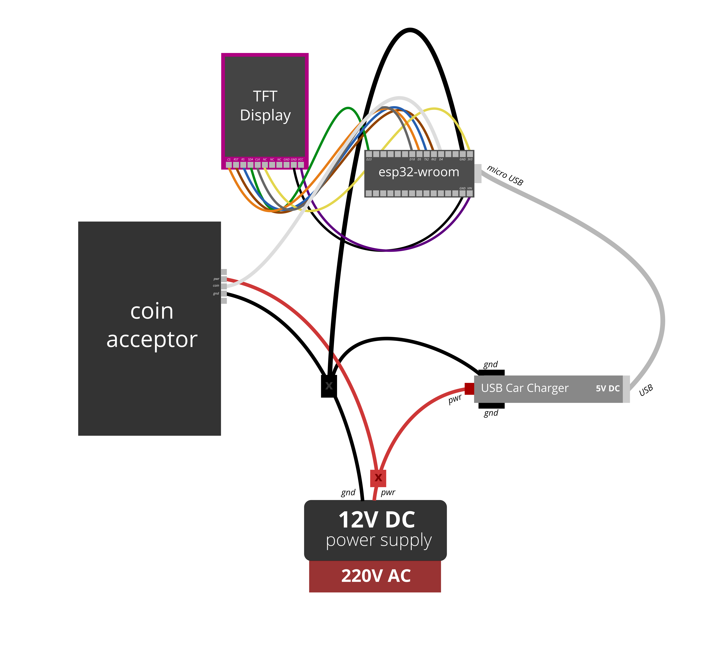
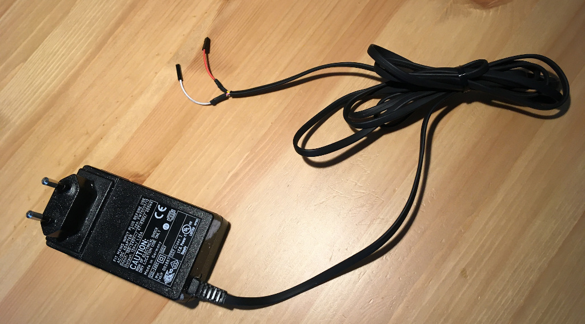

# Bleskomat

The offline Lightning Network ATM - just plug it in and it works!


* [Overview](#overview)
* [Requirements](#requirements)
	* [Hardware Requirements](#hardware-requirements)
	* [Software Requirements](#software-requirements)
* [Setup](#setup)
	* [Building the Hardware Device](#building-the-hardware-device)
		* [Wiring Diagram (w/ Coin Acceptor)](#wiring-diagram-w-coin-acceptor)
		* [Wiring the Power Supply](#wiring-the-power-supply)
		* [Wiring the TFT Display](#wiring-the-tft-display)
	* [Training the Coin Acceptor](#training-the-coin-acceptor)
	* [Installing Libraries and Dependencies](#installing-libraries-and-dependencies)
* [Compiling and Uploading to Device](#compiling-and-uploading-to-device)
* [Running the HTTP Server](#running-the-http-server)
* [Remote Tunneling](#remote-tunneling)
	* [Using SSH and a VPS](#using-ssh-and-a-vps)
	* [Using ngrok](#using-ngrok)
* [License](#license)


## Overview

Key features of the Bleskomat ATM include:
* Works offline - no WiFi required
* Inexpensive, easily-sourced components
* Easily hackable and extendible
* Plug it in and it's ready to accept fiat in seconds

The project consists of two parts:
* __HTTP Server__ - supports [lnurl-withdraw](https://github.com/btcontract/lnurl-rfc/blob/master/lnurl-withdraw.md) with additional request handlers for fiat-currency -> satoshi conversion and request signing.
* __Physical Device (ATM)__ - user inserts coins, device generates a signed LNURL and displays as QR code, user's app (which supports lnurl-withdraw) scans QR code and makes request to HTTP server, withdraw process is completed and the user has successfully bought satoshis with fiat coins.


## Requirements

This section includes information about the requirements (software + hardware) that you will need to build your own Bleskomat ATM.


### Hardware Requirements

To build the physical device, you will need the following hardware components:
* [ESP-WROOM-32](https://www.espressif.com/en/products/modules/esp-wroom-32/overview) by espressif
* TFT Display - The 1.8 inch (128x160 pixel) model is assumed by default
* Coin Acceptor - "Model HX-616"
* 12V DC power adaptor with \~1A
* USB car charger (12V -> 5V DC)

It is strongly recommended to use a multimeter while wiring the device.


### Software Requirements

* [make](https://www.gnu.org/software/make/) - used as a meta task runner
* [PlatformIO Core (CLI)](https://docs.platformio.org/en/latest/core/) - used to compile and upload the firmware to the ESP32
* [nodejs](https://nodejs.org/) - used to run the HTTP server and as a task runner
	* On Linux and Mac install node via [nvm](https://github.com/creationix/nvm)


## Setup

Step-by-step setup process including both hardware and software.

### Building the Hardware Device

Before proceeding, be sure that you have all the project's [hardware requirements](#hardware-requirements).

#### Wiring Diagram (w/ Coin Acceptor)

Here is a wiring diagram for the Bleskomat ATM with coin acceptor:



#### Wiring the Power Supply

The first step to building the device is wiring the power supply. If already plugged in, __unplug__ the 12V DC power supply now. Use scissors to cut the end off the power supply so that you can freely access the two wires within, as shown in the following image:



It is important to test the wires to know for certain which is the ground. Use a [multimeter](https://duckduckgo.com/?q=multimeter&t=canonical&iar=images&iax=images&ia=images) to measure the voltage of the power supply:
* Plug-in the power supply to electricity
* Turn on your multimeter and set it to measure voltage in the appropriate range
* Touch the __red__ lead of your multimeter to one of the wires
* Touch the __black__ lead of your multimeter to the other wire
* If you see a negative voltage reading, swap the leads between the two wires
* The wire touched by the __black__ lead is the ground ("gnd")
* The wire touched by the __red__ lead is the hot wire ("pwr")
* Unplug the power supply again

The next step is to wire in the USB car charger. The end of the car charger - the round metal part that can be pushed in - is the 12V DC in ("pwr"). The two pieces of metal on the sides are the ground ("gnd"). Connect a new red wire to the car charger's 12V DC in connector. Connect a new black wire to one of the car charger's ground connectors. Connect these new wires to the corresponding wires of the power supply. Plug-in a USB cable to the car charger (USB2/3 to micro USB). This micro USB connector will power the ESP32 device.

Now connect the "pwr" and "gnd" wires of your coin acceptor to the corresponding wires of the power supply.

#### Wiring the TFT Display

Have a look at the [wiring diagram](#wiring-diagram-w-coin-acceptor) above or the following is a table of cable mappings for connecting the ESP32 to TFT Display:

|  ESP32       | TFT        |
|--------------|------------|
| VIN          | VCC        |
| GND          | GND        |
| GPIO5  (D5)  | CS         |
| GPIO16 (RX2) | RESET (RS) |
| GPIO17 (TX2) | AO (DC)    |
| GPIO23 (D23) | SDA        |
| GPIO18 (D18) | SCK        |
| 3.3V (3V3)   | LED (NC)   |


### Training the Coin Acceptor

Be sure that you've already finished wiring the power supply to all the components before continuing with this step.

Plug-in the power supply so that all the electronic components have power.

An instruction sheet is included with the coin acceptor that will guide you through the training process:


### Installing Libraries and Dependencies

Before proceeding, be sure that you have all the project's [software requirements](#software-requirements).

Use make to install libraries and dependencies for both the device firmware and HTTP server:
```bash
make install
```
* The server's dependencies are defined in its package.json file located at `./server/package.json`
* The firmware's dependencies are defined in its platformio.ini file located at `./device/platformio.ini`

If while developing you need to install a new library for the device firmware, use the following as a guide:
```bash
cd ./device
platformio lib install --save LIBRARY_NAME[@VERSION]
```
The `--save` flag tells platformio to add the library to the project's `platformio.ini` file.

You can find PlatformIO's libraries repository [here](https://platformio.org/lib).

If you need to add dependencies to the server:
```bash
cd ./server
npm install --save LIBRARY_NAME[@VERSION]
```


## Compiling and Uploading to Device

Be sure that you've already [installed libraries and dependencies](#installing-libraries-and-dependencies) before continuing here.

To compile the firmware (without uploading to a device):
```bash
make compile
```

To compile and upload to your device:
```bash
make upload
```
If you receive a "Permission denied" error about `/dev/ttyUSB0` then you will need to set permissions for that file on your system:
```bash
sudo chown $USER:$USER /dev/ttyUSB0
```

To open the serial monitor:
```bash
make monitor
```


## Running the HTTP Server

Be sure that you've already [installed libraries and dependencies](#installing-libraries-and-dependencies) before continuing here.

To start the server:
```bash
make server
```
A configuration file is automatically generated for you to help get you started. The auto-generated config file is located at `./server/config.json`.

By default the server uses a mock c-lightning node. Once you're ready to connect your own Lightning Network node, have a look at the [lnurl-node](https://github.com/chill117/lnurl-node#lightning-backend-configuration-options) documentation for how to configure the server's lightning backend.

The server is only accessible on your local machine. But in order for the whole UX flow to work, you will need to expose it to the internet - see [Remote Tunneling](#remote-tunneling).


## Remote Tunneling

For the end-user's mobile device to be able to communicate with the server, the server will need to be exposed to the internet. One way to do this is to setup a remote tunnel. Here are described a couple different ways you can do this.


### Using SSH and a VPS

You can use this method if you already have a virtual private server (VPS) with its own static, public IP address.

Login to your VPS and add a few required configurations to its SSH config file:
```bash
cat >> /etc/ssh/sshd_config << EOL
    RSAAuthentication yes
    PubkeyAuthentication yes
    GatewayPorts yes
    AllowTcpForwarding yes
    ClientAliveInterval 60
    EOL
```
Restart the SSH service:
```bash
service ssh restart
```
On your local machine, run the following command to open a reverse-proxy tunnel:
```bash
ssh -v -N -T -R 3000:localhost:3000 VPS_HOST_OR_IP_ADDRESS
```
This will forward all traffic to port 3000 to the VPS thru the SSH tunnel to port 3000 on your local machine.

Set the value of `url` in `./server/config.json` as follows:
```js
{
	// ..
	"url": "http://VPS_IP_ADDRESS:3000"
	// ..
}
```
Be sure to replace `VPS_IP_ADDRESS` with the IP address of your server.

Stop the server if it's currently running - press <kbd>Ctrl</kbd> + <kbd>C</kbd>.

Start the server again:
```bash
make server
```


### Using ngrok

If you don't have access to your own VPS, [ngrok](https://ngrok.com/) is another possible solution. Follow the installation instructions on the project's website before continuing here. Once you have ngrok installed, you can continue with the instructions here.

To create an HTTP tunnel to the local server:
```bash
ngrok http -region eu 3000
```
Copy and paste the HTTPS tunnel URL to `url` in `./server/config.json` as follows:
```js
{
	// ..
	"url": "https://0fe4d56b.eu.ngrok.io"
	// ..
}
```
Note that each time you open a tunnel with ngrok, your tunnel URL changes.

Stop the server if it's currently running - press <kbd>Ctrl</kbd> + <kbd>C</kbd>.

Start the server again:
```bash
make server
```


## License

The device firmware source code is licensed under the [GNU General Public License v3 (GPL-3)](https://tldrlegal.com/license/gnu-general-public-license-v3-(gpl-3)):
> You may copy, distribute and modify the software as long as you track changes/dates in source files. Any modifications to or software including (via compiler) GPL-licensed code must also be made available under the GPL along with build & install instructions.

The server source code is licensed under the [GNU Affero General Public License v3 (AGPL-3.0)](https://tldrlegal.com/license/gnu-affero-general-public-license-v3-(agpl-3.0)):
> The AGPL license differs from the other GNU licenses in that it was built for network software. You can distribute modified versions if you keep track of the changes and the date you made them. As per usual with GNU licenses, you must license derivatives under AGPL. It provides the same restrictions and freedoms as the GPLv3 but with an additional clause which makes it so that source code must be distributed along with web publication. Since web sites and services are never distributed in the traditional sense, the AGPL is the GPL of the web.
